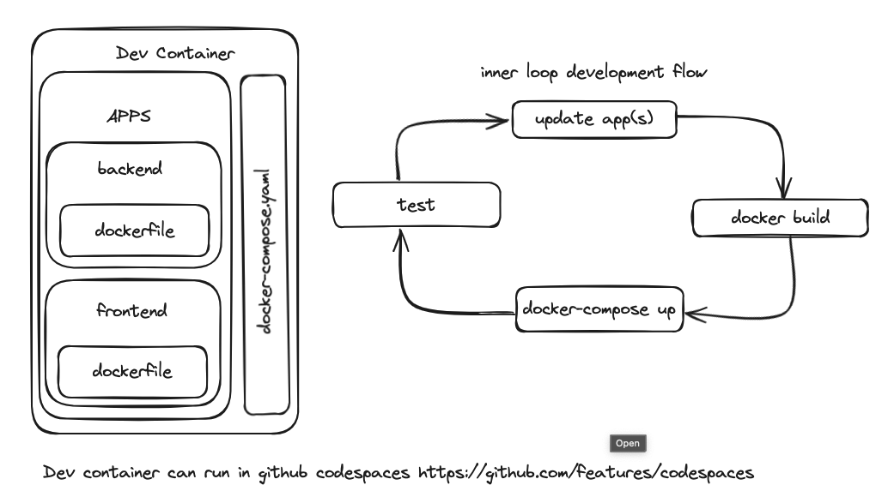

# Developer Experience

This example has been developed with the goal of simplifying the process of maintaining and updating the solution.

The following outlines the steps to set up a development environment, provide team members the ability to update the solution, and run the changes locally in order to test them. The focus is placed on the speed of the update->run->test cycle for the solution.

## Overview



## Deployment and Development using Codespaces

We recommend using Codespaces for both deployment and development because all necessary and recommended tooling comes preinstalled.

If using codespaces to deploy Azure resources, you must use a [local VS Code instance](https://docs.github.com/en/codespaces/developing-in-codespaces/using-github-codespaces-in-visual-studio-code).

Running Codespaces through a local VS Code instance is required because you can then log in to the Azure CLI without using a device code.

Logging in with a device code is the only way to log in when using Codespaces through the browser.

When logging in with a device code, some commands (e.g., Active Directory calls) required to execute the setup scripts will not work due to conditional access policies.

### Connecting to the Correct Tenant & Setting the Correct Subscription Context

When authenticating with the Azure portal using the [Azure CLI]('https://learn.microsoft.com/en-us/cli/azure/authenticate-azure-cli'),
it is important to use the correct Tenant ID for the desired tenant and to set the correct subscription context.

This ensures that in this “one-to-many” tenant world, the correct tenant is utilized each time.

```bash
az login --tenant 16b3c013-d300-468d-ac64-7eda0820b6d3

az account set -s MCAPS-43649-AUS-DEVCREWS
```

#### Resource Names

```bash
# Choose Base Resource Name
export ResourceNameBase="<model deployment name>"
```

```bash
export ResourceGroupName="$ResourceNameBase-RG"
export OpenAIName="$ResourceNameBase-OAI"
export CosmosDbName="$ResourceNameBase"cosmos
export Location=eastus2
export OpenAIModelName=gpt-35-turbo
```

#### Deploy Required Resources

```bash
# Deploy Resource Group
az group create --name $ResourceGroupName --location $Location
```

```bash
# Deploy Open AI
az cognitiveservices account create \
--name $OpenAIName \
--resource-group $ResourceGroupName \
--location $Location \
--kind OpenAI \
--sku s0
```

```bash
# Deploy Model
az cognitiveservices account deployment create \
--name $OpenAIName \
--resource-group  $ResourceGroupName \
--deployment-name $OpenAIModelName \
--model-name $OpenAIModelName \
--model-version "0613" \
--model-format OpenAI \
--sku-capacity "1" \
--sku-name "Standard"
```

```bash
# Get Endpoint URL
export OpenAIEndpoint=$(az cognitiveservices account show --name $OpenAIName --resource-group $ResourceGroupName | jq -r .properties.endpoint)
```

```bash
# Get Primary Key
export OpenAIKey=$(az cognitiveservices account keys list --name $OpenAIName --resource-group $ResourceGroupName | jq -r .key1)
```

```bash
# Deploy Cosmos Resource
az cosmosdb create -g $ResourceGroupName -n $CosmosDbName

# Create Cosmos Database
az cosmosdb sql database create -a $CosmosDbName -n $CosmosDbName -g $ResourceGroupName

# Create CosmosDB Container
az cosmosdb sql container create -a $CosmosDbName -d $CosmosDbName -n $CosmosDbName -p "/partitionKey" -g $ResourceGroupName --ttl -1

# Get document endpoint
CosmosKey=$(az cosmosdb keys list --name $CosmosDbName -g $ResourceGroupName --query primaryMasterKey --output tsv)
```

### Create credentials.env

```bash
cat <<EOF > "apps/credentials.env"
AZURE_OPENAI_ENDPOINT=$OpenAIEndpoint
AZURE_OPENAI_API_KEY=$OpenAIKey
AZURE_OPENAI_API_VERSION="2023-12-01-preview"
BLOB_SAS_TOKEN=""
AZURE_OPENAI_MODEL_NAME=$OpenAIModelName
AZURE_COSMOSDB_ENDPOINT=https://$CosmosDbName.documents.azure.com:443/
AZURE_COSMOSDB_NAME=$CosmosDbName
AZURE_COSMOSDB_CONTAINER_NAME=$CosmosDbName
AZURE_COSMOSDB_CONNECTION_STRING="AccountEndpoint=https://$CosmosDbName.documents.azure.com:443/;AccountKey=$CosmosKey;"
EOF
```

> Note: You can also provision the infrastructure by [deploying a Bicep template file](./infra/README.md) using the Command Line Interface (CLI).

### Adding sample data

To add an example index to Azure AI Search, you can run the following command:

```
make create-index-and-load-data
```

This will create an index, datasource, indexer and skillset that will populate some data into an index using the ```./search_index/data.json```

This process will also ensure that all the required environment variables are set first. If this is not the case, the process will stop with an error on the missing environment variable.

This performs 2 separate steps:

1. Creates the index, skillset, datasource and indexer within Azure AI Search. This can be performed separately using ```make create-index```
2. Loads the sample data into the index. This can be performed using  ```make load-json-data```

### Build and Run Docker Images

Running the following Docker Compose command will build the latest images and then run them with the required networking, secrets, services, and port forwarding. Open [docker-compose.yaml](./apps/docker-compose.yaml) for more info.

```bash
cd apps
docker compose up -w
```

## Remote Deployment

To deploy frontend and backend of application remotely, see the following READMEs.

- [Deploy Front End](../../apps/frontend/README.md)

- [Deploy Back End](../../apps/bot-service/Dockerfile)
