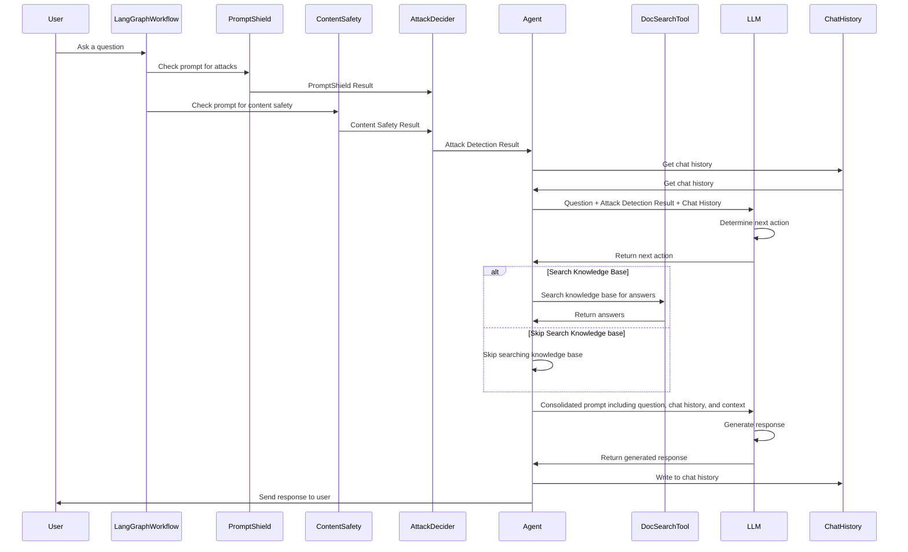
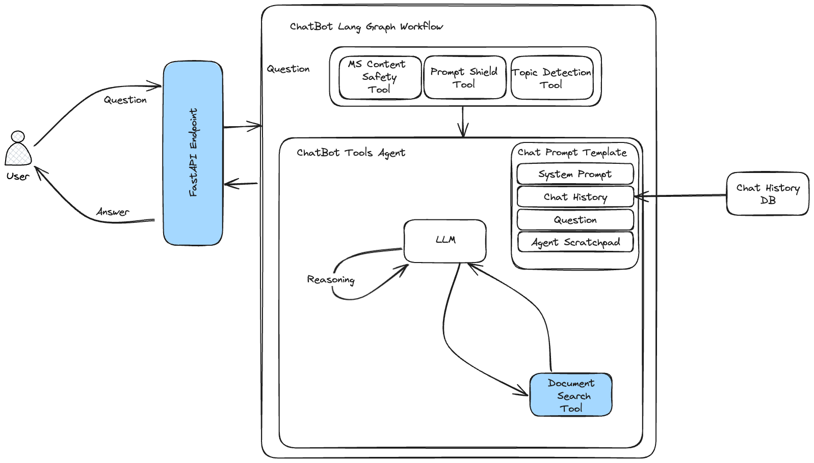

# GenAI Chatbot Example Solution Overview

## Solution Design

### Overview

The solution is a LangChain-based set of APIs that can be used by a chatbot. The APIs are put together using the FastAPI framework and LangServe. A Docker file is provided for the service to create a Docker image that can be used for running the application locally or deploying to other environments.

In addition to the service, a Streamlit application is provided to make it possible to test the bot service locally through a chatbot web interface.

The chatbot service is an agentic service, meaning that it is composed of an agent responsible for orchestrating the functionality of the service. The agent decides when to respond or call external tools.

This type of solution is greatly dependent on the prompt that the system sends to the LLM. This describes how the system behaves. [Documentation for the prompt can be found here](prompt_engineering.md).

### Features

[List of features can be found here](../../README.md#accelerator-features)

### Frameworks/Concepts in Use

- LangChain is being used as an implementation framework. The GenAI CHatbot POC was created using the [Azure Cognitive Search Azure OpenAI Accelerator](https://github.com/MSUSAzureAccelerators/Azure-Cognitive-Search-Azure-OpenAI-Accelerator/). This accelerator uses LangChain agents to implement a chatbot that calls tools. In the GenAI Chatbot implementation, the tools being called perform a search against Azure AI Search indexes.

- Retrieval Augmented Generation (RAG) - GenAI Chatbot uses information retrieval to get context regarding articles in a knowledge base.
[Retrieval Augmented Generation (RAG) Overview](https://learn.microsoft.com/en-us/azure/search/retrieval-augmented-generation-overview)

- Agents - The GenAI Chatbot solution leverages the concept of agents, which work by using a language model to choose the sequence of actions to take. For the implementation, the tool uses
[LangChain Agents](https://python.langchain.com/v0.1/docs/modules/agents/)

- Tools - The GenAI Chatbot solution uses tools, which are interfaces that the agent can use to interact with external systems. In this particular solution, tools are used to query search index as well as to call Microsoft Content Safety endpoints prior to calling an LLM. [LangChain Tools Overview](https://python.langchain.com/v0.1/docs/modules/tools/)

- Reasoning and Acting (ReAct) Prompting Technique - a prompt technique that combines reasoning and acting advances to enable language models to solve various language reasoning and decision-making tasks. [React: Synergizing Reasoning and Acting in Language Models](https://research.google/blog/react-synergizing-reasoning-and-acting-in-language-models/)

- LangGraph Workflow - used to create a workflow that first calls content safety/prompt shield endpoints and, based on the results, proceeds to call the agent accordingly [LangGraph Documentation](https://langchain-ai.github.io/langgraph/)

### Solution Components

#### LangGraph Workflow

Technology: [LangGraph Documentation](https://langchain-ai.github.io/langgraph/)

Description: The LangGraph Workflow provides the definition for the graph that is executed when the bot service is called.

#### Azure AI Content Safety - PromptShield

Technology: [Azure AI Content Safety - PromptShields](https://learn.microsoft.com/en-us/azure/ai-services/content-safety/concepts/jailbreak-detection)

Description: Prompt shield targets User Prompt injection attacks, where users deliberately exploit system vulnerabilities to elicit unauthorized behavior from the LLM. This could lead to inappropriate content generation or violations of system-imposed restrictions.

#### Azure AI Content Safety - Harm Detection

Technology: [Azure AI Content Safety - Harm Categories](https://learn.microsoft.com/en-us/azure/ai-services/content-safety/concepts/harm-categories)

Description: This Content Safety Service is used to flag objectionable content based on four harm categories

- Hate and Fairness
- Sexual
- Violence
- Self-Harm

#### Attack Decider

Technology: Custom code

Description: The AttackDecider is a Function that changes prompt based on the results from the Content Safety components

#### Agent

Technology: [LangChain Tool Calling Agent](https://python.langchain.com/v0.1/docs/modules/agents/agent_types/tool_calling)

Description: The langchain agent is the orchestrator of what actions will be taken to answer the users question. It has ability
to reason and decide to answer the question directly or call a tool that is available to it to add additional context.  This capability
is provided by the LLM.  Currently this agent has access to a tool that searches an index that knowledge base.  The index is used by the
agent to get grounding data used in Retrieval Augmented Generation pattern while answering the users question.

#### LLM (Language Learning Model)

Technology: Azure OpenAI Gpt-4o

Description: The llm provides the reasoning and answer generation capabilities.

#### Prompt Generator

Technology: Custom Python Code

Description: The functionality of the solution is defined largely by the prompt that is provided to the system.
The prompt contains instructions for how the LLM will make decisions, what questions it will answer or not answer.
The tone of the responses, when to call the tools, how to structure the response, etc.  Given the importance of this
component, a separate section is provided around prompt engineering for the system.  The goal of this component is to
help simplify the process of maintaining the system prompts.  [Prompt Maintenance Instructions Can be Found Here](prompt_maintenance.md).

#### Search Tool

Technology: LangChain retriever that searches an Azure AI Search index

Description: LangChain retriever tool that searches an Azure AI Search index.  The solution searches this tool and
the tool receives 10 results back from the search.

Index contains knowledge data where the items include the following information:

#### Chat History

Technology: CosmosDB

Description: Each user session maintains a history of interactions to use as context in the conversation.  This
allows for conversations to be able to refer to earlier answers.

### Sequence Diagram



## Solution Diagram



### API Contract

The following APIs are exposed by the service:

### /agent/invoke

Request body:

``` json
{
  "input": {
    "question": "string"
  },
  "config": {
    "configurable": {
      "session_id": "",
      "user_id": ""
    }
  },
  "kwargs": {}
}
```

Response:

``` json
{
  "output": {
    "output": "string"
  },
  "metadata": {
    "run_id": "3fa85f64-5717-4562-b3fc-2c963f66afa6",
    "feedback_tokens": [
      {
        "key": "string",
        "token_url": "string",
        "expires_at": "2024-07-01T22:19:32.452Z"
      }
    ]
  }
}
```

### /agent/streaming

The endpoint uses a server sent event stream to stream the output.

<https://developer.mozilla.org/en-US/docs/Web/API/Server-sent_events>

The encoding of events follows the following format:

data - for streaming the output of the runnable

{ "event": "data", "data": { ... } }

error - for signaling an error in the stream, also ends the stream.

{ "event": "error", "data": { "status_code": 500, "message": "Internal Server Error" } }

end - for signaling the end of the stream.

This helps the client to know when to stop listening for events and know that the streaming has ended successfully.

{ "event": "end", }

data for the data event is a JSON object that corresponds to a serialized representation of a StreamEvent.

See LangChain documentation for more information about astream_events.
