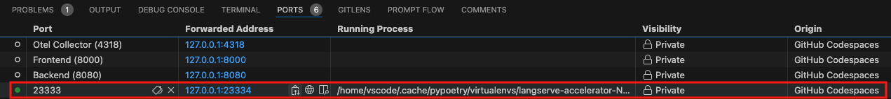

# Run Evaluations

- [Prerequisites](#prerequisites)
- [Set Up Environment](#set-up-environment-to-run-evaluations)
- [Execute Evaluation](#execute-evaluation)

## Prerequisites

- **VS Code Extension**: [PromptFlow for VS Code](https://marketplace.visualstudio.com/items?itemName=prompt-flow.prompt-flow)
extension is installed and setup.
- Evaluations will leverage environment variables that can be set using your dotenv file for credentials
and other setting needed to run the systems being evaluated- example can be found at [sample_dotenv_file](sample_dotenv_file)
- You must have the resources available which are mentioned in the dot_env_file in order to run evaluations
- (OPTIONAL) If you wish to publish results to an AI Studio Project you must have a hub and a project created and ensure
the environment variables are set for those
for this purpose <https://learn.microsoft.com/en-us/azure/ai-studio/concepts/ai-resources>

## Set Up Environment To Run Evaluations

Please run these inside a [GitHub Codespace](https://github.com/features/codespaces) or [Dev Container](https://containers.dev/) to avoid local environment issues.

The following steps need to be run only once per codespace/dev container, instructions assume
user is running the steps from the project root.

```bash
# Navigate to bot-service directory
cd apps/bot-service # assumes you are at the root of the project
# Create virtual environment using poetry to install packages to evaluate
poetry install
# Activate virtual environment in terminal
eval "source $(poetry env info --path)/bin/activate"
# Navigate back to root of project
cd ../../evaluation
# Install python requirements
poetry install

# Validate promptflow versions
pf -v
# Response should look like this - ensure at least 1.13 version and 0.3.1 for evals
# {
#   "promptflow": "1.13.0",
#   "promptflow-azure": "1.13.0",
#   "promptflow-core": "1.13.0",
#   "promptflow-devkit": "1.13.0",
#   "promptflow-evals": "0.3.1",
#   "promptflow-tracing": "1.13.0"
# }
```

The following commands are required to be run once per terminal instance.
The instructions assume that user is running them from project
root.

```bash
# Activate virtual environment in terminal
cd apps/bot-service
eval "source $(poetry env info --path)/bin/activate"
cd ../../..
# Set environment variables
export $(grep -v '^#' <path to dot_env file>| xargs)
```

If you want to publish results to AI Studio Project run the following command - environment
variables should be set prior - this is optional since you will be able to see results of
runs locally

```bash
# Log into azure subscription
az login
# Select subscription if you can find it in list or run the following command if you dont find it
az account set -s $SUBSCRIPTION_ID
# Set trace destination
pf config set trace.destination=azureml://subscriptions/$SUBSCRIPTION_ID/resourcegroups/$RESOURCE_GROUP/providers/Microsoft.MachineLearningServices/workspaces/$PROJECT_NAME
```

## Execute Evaluation

Once setup above has been done you can execute evaluation by running an evaluation script
Assumption is that these steps are being run from project root.

```bash
python evaluation/run_evaluations/evaluate_full_flow.py
# You can capture output to a log file by appending &> filename to the end of that command
# python evaluation/evaluate_full_flow.py &>output.log
```

After running the flow you should be able to view results of run at the forwarded port
you will see what port the app is available by looking in vscode ports tab


## Run Unit Tests

To get started with running the evaluation unit tests, run through the following steps:

```bash

# navigate to root of repo
cd /workspaces/botify

# install all required tools
poetry install --directory=apps/bot-service

# activate virtualenv
source $(poetry env info --path --directory apps/bot-service)/bin/activate

## navigate to eval directory
cd ../../evaluation

# Install eval specific python requirements
poetry install

# run evaluation unit tests
python -m unittest discover -s ./tests/unit -t ./tests

# exit virtualenv
deactivate

```
